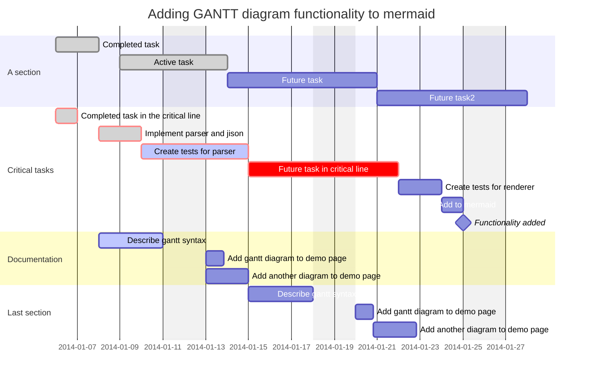

---
{"dg-publish":true,"permalink":"/weekend-reader-week-43-2022/","dgShowBacklinks":true,"dgShowLocalGraph":true,"dgShowInlineTitle":true}
---

---

**Cross-Tenant OneDrive Migration**
Microsoft is looking after companies that have the need to migrate OneDrive content from one tenant to another. Perfect, as cloud adoption has definitely created some need for that functionality - https://learn.microsoft.com/en-gb/microsoft-365/enterprise/cross-tenant-onedrive-migration?view=o365-worldwide

**Cybersecurity is for everyone—this October and all year**
Little summary of what Microsoft offers for this years *Cybersecurity Awareness Month*. This mainly links to Microsoft learning paths, of which I am a big fan - https://techcommunity.microsoft.com/t5/microsoft-learn-blog/cybersecurity-is-for-everyone-this-october-and-all-year/ba-p/2319502#

**What’s new in Security and Management in SharePoint, OneDrive, and Teams – Microsoft Ignite 2022**
Post Ignite is a great time to go through different posts collecting news specific per product. Here we have a summary of Security and Management related announcements for Teams, SharePoint online and OneDrive - https://techcommunity.microsoft.com/t5/microsoft-sharepoint-blog/what-s-new-in-security-and-management-in-sharepoint-onedrive-and/ba-p/3648912

